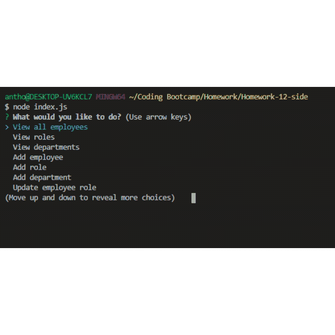

# The Employee Tracker

## Description
description

## Table Of Contents
* [Installation](#installation)
* [Usage](#usage)
* [License](#license)
* [Contributing](#contributing)
* [Tests](#tests)
* [Questions](#questions)

## Installation
In order to run this Employee Tracker, you will need to run the following command:
``sh
npm install
``
To install the necessary package dependencies of this app

## Usage
Running the Node command:
``sh
node index.js
``
Will present the user with various options to:
-View all employees
-View Roles
-View Departments
-Add employees
-Add roles
-Add departments
-Update employee roles

See below for the app in action:

## License

* 

## Contributing

* [asmith8494](http://github.com/asmith8494)

## Test

* 

## Questions

* Email: anthony.smith353@gmail.com

